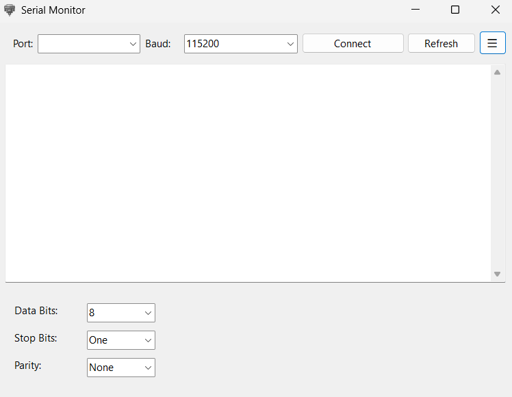

# SerialSense 🔌💻

**SerialSense** is a modern and intuitive Windows Forms application built with .NET 8.0 that allows you to monitor, decode, and interact with serial data from microcontrollers such as Arduino, Raspberry Pi Pico, ESP32, and more. Designed with user experience in mind, it offers configurable communication settings and a clean UI.

---

## ✨ Features

- Auto-detects available COM ports
- Connect/Disconnect to serial devices easily
- Supports common baud rates (9600, 115200, etc.)
- Configure:
  - Data Bits
  - Stop Bits
  - Parity
- Toggleable settings panel via hamburger menu
- UTF-8 support for characters like `°`, `Ω`, etc.
- Smooth auto-refresh and display of incoming serial data
- Custom icon integration for form and `.exe`

---

## 🖥️ UI Preview

<!-- > Add screenshots here of the app running, especially showing the serial output and settings panel. -->
<p align="center">
  
</p>

---

## 🔧 Tech Stack

- Language: C# (.NET 8.0)
- Framework: Windows Forms (WinForms)
- IDE: Visual Studio / Visual Studio Code with PlatformIO (for embedded)
- Deployment: Self-contained `.exe` via `dotnet publish`

---

## 📦 Folder Structure

```bash
SerialSense/
│
├── SerialSense.sln
├── Program.cs
├── Form1.cs
├── Form1.Designer.cs
├── Resources/
│   └── app.ico              # Custom icon used for .exe and form
├── Properties/
│   └── launchSettings.json  # (if created)
├── publish/                 # Published .exe goes here
├── bin/
├── obj/
└── README.md
```

---

## 🚀 How to Build

1. Open `SerialSense.sln` in Visual Studio.
2. Ensure configuration is set to `Release`.
3. Go to `Build > Publish > FolderProfile`.
4. Choose:
   - ✅ Produce single file
   - ✅ Trim unused assemblies
   - ✅ (Optional) Enable ReadyToRun
5. Click **Publish** to generate `.exe` in the `publish/` directory.

---

## 🔄 How to Use

1. Plug in your USB device (Arduino, Pico, etc.).
2. Select the correct COM Port and Baud rate.
3. Expand the ⚙️ Settings panel for additional configurations.
4. Click **Connect**.
5. View incoming serial data in real-time.

---

## 📃 License

MIT License. You are free to modify and use it.

---

## 👨‍💻 Author

**Anubhav Dutta**

- 💼 Embedded Software Engineer | System Designer
- 🌐 [Portfolio Website](https://luke-anubis.vercel.app)
- 📫 [GitHub](https://github.com/anubhav666)


---

> _Built for debugging embedded systems, made with developers in mind._ 🔧🧠
